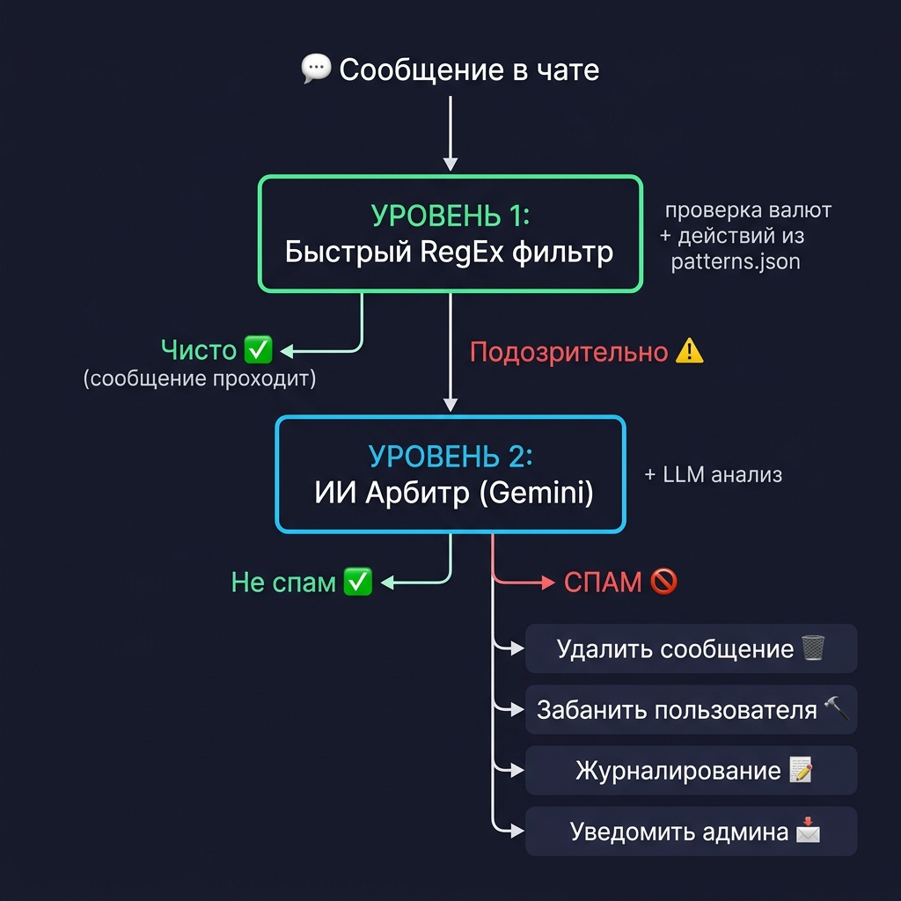
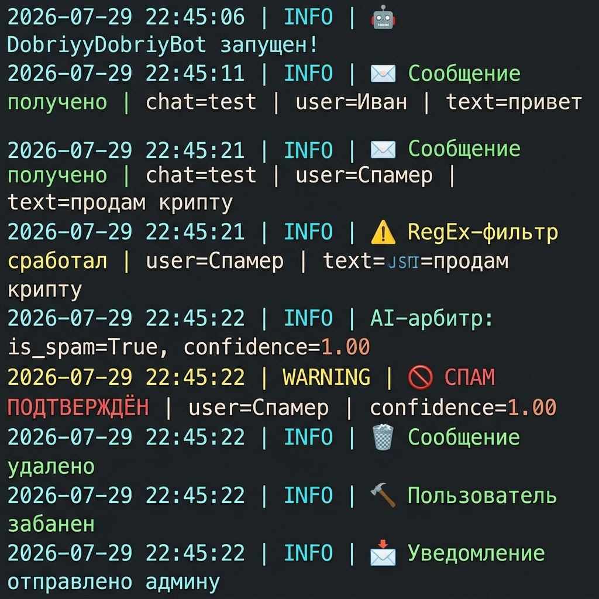
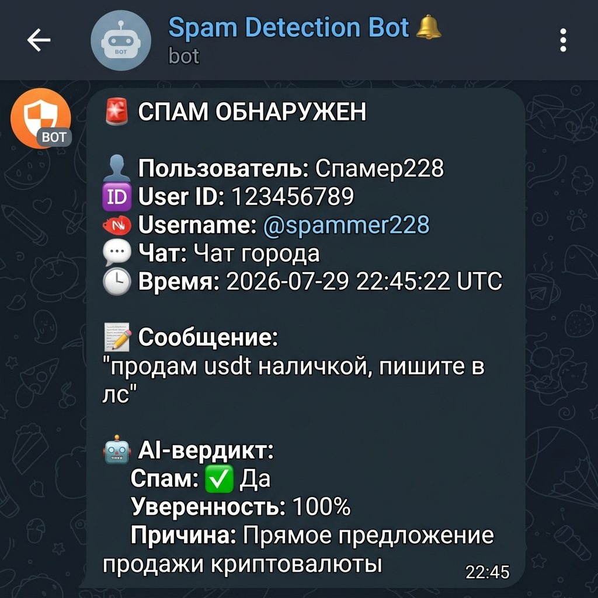

# 🛡️ DobriyDobriyBot

**Двухуровневая антиспам-система для Telegram-чатов** — автоматическое обнаружение и удаление объявлений о нелегальном обмене валюты и криптовалюты.



## ✨ Возможности

- 🔍 **Уровень 1: Быстрый RegEx-фильтр** — мгновенная проверка по базе ключевых слов (валюты + действия)
- 🤖 **Уровень 2: AI-арбитр (Gemini)** — проверка подозрительных сообщений через LLM для исключения ложных срабатываний
- 🗑️ **Автоудаление** спам-сообщений
- 🔨 **Автобан** спамеров (с защитой админов)
- 📩 **Уведомления** администратору с полными данными о нарушителе
- 📝 **Логирование** в консоль и файл (`logs/spam.log`)

## 🏗️ Архитектура

```
[Сообщение в чате]
       │
       ▼
┌─────────────────────────────────────┐
│ УРОВЕНЬ 1: Быстрый RegEx-фильтр    │
│ patterns.json: валюты + действия    │
└──────────┬──────────────────────────┘
           │
    ┌──────┴──────┐
    ▼             ▼
[Чисто ✅]   [Подозрение ⚠️]
Пропускаем        │
                  ▼
┌─────────────────────────────────────┐
│ УРОВЕНЬ 2: AI-арбитр (Gemini)       │
│ prompt.txt → JSON-вердикт           │
└──────────┬──────────────────────────┘
           │
    ┌──────┴──────┐
    ▼             ▼
[Не спам ✅]  [СПАМ 🚫]
Пропускаем     │
               ├─→ 🗑️ Удаление сообщения
               ├─→ 🔨 Бан пользователя
               ├─→ 📝 Лог (консоль + файл)
               └─→ 📩 Уведомление админу
```

## 📸 Скриншоты работы

### Терминал: обнаружение и удаление спама



### Уведомление администратору



## 🚀 Быстрый старт

### Требования

- Python 3.13+
- [uv](https://docs.astral.sh/uv/) (менеджер пакетов)
- Telegram Bot Token ([создать в @BotFather](https://t.me/BotFather))
- Gemini API Key ([получить в Google AI Studio](https://aistudio.google.com/))

### Установка

```bash
# 1. Клонируйте репозиторий
git clone https://github.com/Nam0vicH/DobriyDobriyBot.git
cd DobriyDobriyBot

# 2. Установите зависимости
uv sync

# 3. Создайте .env файл
cp .env.example .env
```

### Настройка

Отредактируйте `.env`:

```env
TELEGRAM_BOT_TOKEN=ваш_токен_от_BotFather
GEMINI_API_KEY=ваш_ключ_Gemini_API
ADMIN_CHAT_ID=ваш_telegram_id
```

> 💡 **Как узнать ADMIN_CHAT_ID?** Напишите боту [@userinfobot](https://t.me/userinfobot) — он покажет ваш ID.

### Настройка бота в Telegram

1. Откройте **@BotFather** → `/mybots` → выберите бота
2. **Bot Settings** → **Group Privacy** → **Turn off** (бот должен видеть все сообщения)
3. Добавьте бота в группу и сделайте **администратором** с правами:
   - ✅ Удаление сообщений
   - ✅ Блокировка пользователей
4. **Напишите боту `/start` в личку** (чтобы он мог отправлять вам уведомления)

### Запуск

```bash
uv run python main.py
```

```
2026-07-29 22:45:06 | INFO | Загружены паттерны: 53 валют, 45 действий, 14 исключений
2026-07-29 22:45:06 | INFO | Загружен промт AI-арбитра (1139 символов)
2026-07-29 22:45:06 | INFO | 🤖 DobriyDobriyBot запущен!
```

## 📁 Структура проекта

```
DobriyDobriyBot/
├── main.py           # Основная логика бота
├── prompt.txt        # Системный промт для AI-арбитра
├── patterns.json     # Ключевые слова для RegEx-фильтра
├── pyproject.toml    # Зависимости проекта
├── .env              # Секреты (не в git!)
├── .env.example      # Шаблон .env
├── docs/             # Скриншоты и документация
│   ├── architecture.png
│   ├── terminal_demo.png
│   └── admin_notification.png
└── logs/
    └── spam.log      # Лог обнаруженного спама
```

## ⚙️ Конфигурация паттернов

Файл `patterns.json` содержит три категории:

| Категория | Описание | Пример |
|-----------|----------|--------|
| `currencies` | Валюты и крипто | `usd`, `usdt`, `доллар`, `биток`, `стейблкоин` |
| `actions` | Действия обмена | `прода`, `купл`, `обмен`, `свап`, `в лс` |
| `ignore_words` | Исключения | `официальный курс cbr`, `банковский курс` |

> Фильтр срабатывает, когда в сообщении найдена **валюта + действие** одновременно.

## 🔐 Безопасность

- Админы группы **не банятся** — бот автоматически проверяет права пользователя
- Секреты хранятся только в `.env` (добавлен в `.gitignore`)
- AI-арбитр с низкой температурой (0.1) для стабильных результатов

## 🛠️ Технологии

- **Python 3.13** + **python-telegram-bot** — Telegram API
- **Google Gemini** (`google-genai`) — AI-арбитр
- **RegEx** — быстрая предфильтрация
- **uv** — менеджер пакетов

## 📄 Лицензия

MIT License — см. [LICENSE](LICENSE)
